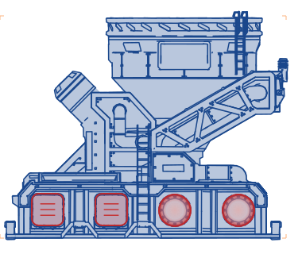
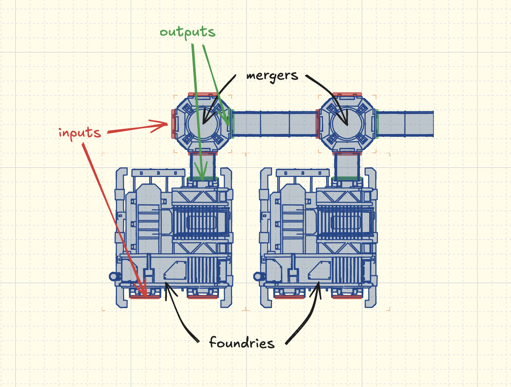
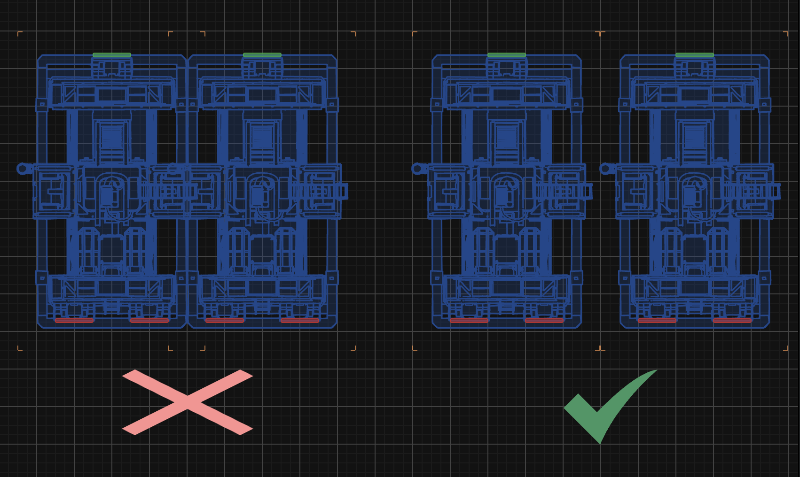

# satisfactory-schematics

> Pre-rendered images of Satisfactory buildings, for use in your favorite diagramming tools.



## How to use

Step 1
Step 2
Step 3

## Scale

The original idea behind this project was to create building schematics I could arrange in Excalidraw (https://excalidraw.com/). Excalidraw uses `20px X 20px` grid markers, so the current themes are rendered at `1m = 20px`. For best results, go to Preferences > Canvas & Shape > Grid step and adjust to 8, then turn on Toggle Grid. Now the major grid markers will represent 1 foundation (8m x 8m) from the top (or 2 wall heights from the side).

Draw.io (https://draw.io/) happens to use `10px X 10px` grids by default, so the same scale works well in Draw.io as well; note that you cannot change the major grid step so 1 foundation will be 2 "squares".

## Annotations: Port markers

For ease of use, input connectors for belts and pipes are marked in red on each building; output connectors are marked in green.



## Annotations: Collision boxes

Each building includes small corner ticks rendered in FICSIT orange, showing where they will collide with other buildings in the game. This is to make it a bit easier to line up e.g. assemblers, where it "looks like" you can tile them next to each other, but the game requires a bit more breathing room.



## How to use these images

Turn a local **Satisfactory** install into true-to-scale orthographic blueprint **SVGs/PNGs**
(top / front / back / left / right) for dropping into Excalidraw, draw.io, or Miro.

This is a clean, standards-enforced rebuild of the pipeline. See
[`NEW_REPO_PLAN.md`](../NEW_REPO_PLAN.md) for the full plan and phase checklists, and
[`SPEC.md`](../SPEC.md) / [`PIPELINE.md`](../PIPELINE.md) for the deep design + step map.

> **Status:** Phase 0 (scaffolding) + Phase 2 (`doctor`) only. The pipeline stages are stubs.

## Quickstart

Full bootstrap (the few things doctor can't do for you) is in
[`GETTING_STARTED.md`](GETTING_STARTED.md). The short version:

```bash
brew install uv          # bootstrap prerequisite (needs Homebrew first)
./sat doctor             # check the machine + install what's missing (with confirmation)
./sat doctor --fix       # auto-run the safe fixes (downloads, brew installs) after confirming
```

`doctor` verifies (and can install) Docker, Blender, potrace, rsvg, the Oodle/zlib libs, and
**hard-stops if your installed game version does not match `config/config.yaml`** (`game.version`).

## Dev

```bash
./sat check              # ruff check + ruff format --check (+ csharpier in Phase 3)
./sat fix                # ruff --fix + ruff format
```

All tooling is Python (plus the C# extractor in Phase 3); there is no bash beyond the tiny
`./sat` launcher, which is itself Python.
